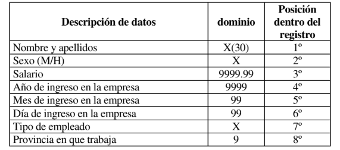
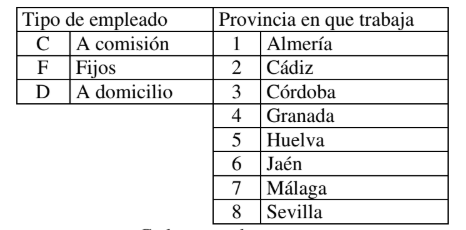
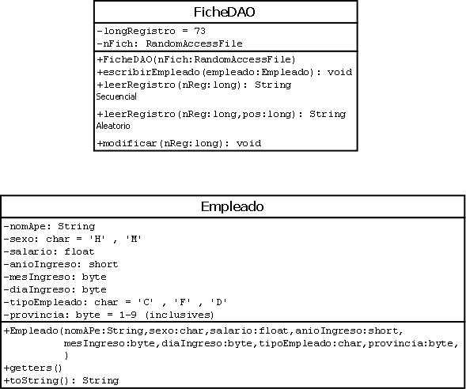

- Individual/ Equipo: Equipo
  La distribución de equipos y sus componentes se publicará en la tarea de Classroom.
- Descripción de la actividad: Realizar la actividad propuesta.
- Fecha y medio de entrega: La fecha y medio de entrega se indicará en la
  publicación de la tarea en Classroom. Si se incumplen las especificaciones indicadas
  en la actividad tanto de contenido como de fecha, formato, nombre o forma de
  entrega, la actividad será calificada con un 0.
- Formato: Se deberá entregar un archivo NombreEquipo.zip conteniendo:
  • un proyecto Netbeans de nombre NombreEquipo conteniendo la
  implementación de la actividad con la especificación indicada en la misma.
  • NombreEquipo.pdf conteniendo, diagrama de clases. Deberá indicarse el
  nombre completo de cada integrante del equipo.

- Especificaciones de entrega: Las particulares de cada ejercicio. Si no se indicara
  alguna especificación concreta, se dejará dicha especificación a criterio del alumno,
  siendo dicha decisión objeto de evaluación junto a la solución del problema. Todos
  los códigos fuentes deben tener el nombre completo del autor. Se valorará la
  organización del proyecto.

La empresa MACHO, S.A. necesita disponer de un fichero secuencial de nombre
FICHE.DAT en el que se lleva el registro de todos los trabajadores de esta empresa en
Andalucía.

Realizar los siguientes programas. Cada apartado es un programa.
a) Crear y llenar el fichero FICHE.DAT.
b) Obtener un listado paginado de todos los empleados que lleven 10 o más años
trabajando en la empresa, dando un porcentaje de éstos por pantalla.
c) Obtener un listado del nombre y sueldo de cada empleado sabiendo:
SUELDO = SALARIO + COMPLEMENTOS

COMPLEMENTOS:

- trienios: cada trienio trabajado se pagará a 24€.
- Destino: los empleados que trabajen en Jaén, Huelva o Almería tendrán
  un complemento del 10% del salario.
- Por la cara: todos los hombres tendrán un complemento extra de 120€.
  (esto explica el nombre de la empresa).

d) Obtenga el nombre y apellidos del empleado(s) que tenga(n) el sueldo superior.
e) Obtenga el nombre de la provincia(s) con mayor número de empleados.
NOTA: Se recomienda hacer c y d juntos.

Primer UML: 
